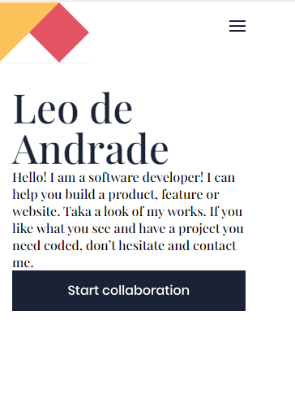

# Portfolio: setup and mobile version skeleton

> For the first milestone in the process of creating your portfolio website, you will:
- set up a new repository and prepare it for development using best practices (e.g. linters).
- build the first 3 sections of the mobile website using the template you chose in the previous step

[Live Demo Link](https://leonardoeng13.github.io/mobile-portfolio/)

## Learning objectives

- Understand how to parse a Figma design to create a UI.
- Flexbox to place elements in the page.
- Build a personal portfolio site.
- Use images and backgrounds to enhance the look of the website.

## Built With

- Major languages: HTML, CSS
- Frameworks: VS Code, Linter
- Technologies used: VS Code, Linter, HTML, CSS

## Live Demo

[Live Demo Link](https://livedemo.com)

## General requirements

- Make sure that there are no linter errors:
    - Linter should be set up correctly for this repository.
    - Linter result should be green.
    - There should be no custom changes to linter config.

- Make sure that you used correct GitHub Flow:
    - README file should be descriptive.
    - Commit messages should be meaningful.
    - Pull Request should have a descriptive title explaining what changes are inside.
    - Pull Request should have a short summary describing introduced changes in more detail.
- Make sure that you documented your work in a professional way:
    - Branch name should describe a feature or action (e.g. 'created_sidebar' or 'added_comments_section').
    - Pull Request is made from 'feature branch' into the main branch.

# Prerequisites

### HTML/CSS requirements
- Follow our list of best practices for HTML & CSS.

### Project Requirements
- For this project, you should use the HTML&CSS linter
- The 2 sections you need to build for this project
- In order to lay out the elements on the page you should use Flexbox in all 2 sections.
- You don't need to implement any functionality that requires JavaScript, like opening the menu or creating dropdowns.
- You must stick to the design as much as possible (e.g. font, colors, images, tests, margins) using the templates in Figma.
- Implement the button interactions (enable, hover, etc.).

### Need a big picture?

Remind me about the big picture of this project.

## Authors

👤 **Author1**

- GitHub: [@gLeonardoeng13](https://github.com/leonardoeng13)
- Twitter: [@Leo de Andrade](https://twitter.com/andrade_leo)
- LinkedIn: [Leonardo de Andrade](https://linkedin.com/in/leonardodeandrade)

👤 **Author2**

## 🤝 Contributing

Contributions, issues, and feature requests are welcome!

Feel free to check the [issues page](../../issues/).

## Show your support

Give a ⭐️ if you like this project!

## Acknowledgments

- Hat tip to anyone whose code was used
- Inspiration
- etc

## 📝 License

This project is [MIT](./MIT.md) licensed.
